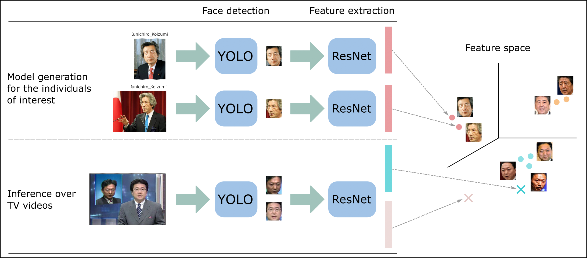

# KAO (Key Actors detectiOn)

[](https://colab.research.google.com/drive/1EnjGijAGKN99elpJJlE_47CJ7CQBxYst?usp=sharing)

# Quick run:

Tested with Python3.8.5

Install requirements

```
pip install -r requirements.txt
```

In case of using YOLO-face detection, download the face model from the [YOLOv5-face](https://github.com/deepcam-cn/yolov5-face) repo by doing:
```
gdown --no-check-certificate --id 1Sx-KEGXSxvPMS35JhzQKeRBiqC98VDDI -O src/external/yolo5_face/models/yolov5m-face.pt
```

To run the demo:
```
bash src/demo.sh
```

### Pipeline
The overall pipeline is the following



1. Gather pictures of individuals to build models
2. Extract embeddings for the models
3. Extract embeddings for the faces in videos
4. Run classifier that will use the extracted detections and features

### Pipeline in detail:

1. Put people of interest inside *data/models*. Every individual
has their own folder. The name of each folder will be the identifier of that person
   (e.g. Donald_Trump). 
   
    Every example (image) of the individual should be renamed as 000001.jpeg, 000002.jpeg, ...

2. Extract model embeddings

```
python src/extract_model_embeddings.py demo tv_news --detector yolo --feats resnetv1
```


3. Run face_detection_kao. Use the option --extract_embeddings (will be generic soon) 

   Generically: 
   ```
   python src/face_detection_kao.py $MODE $CHANNEL --detector $DETECTOR --feats $FEATS --process $PROCESSES --extract_embeddings
   ```

   To run it over the demo videos
   ```
   python src/face_detection_kao.py demo tv_news --detector yolo --feats resnetv1 --extract_embeddings
   ```
   
   There are many options for this script. Check them in *src/config.py*. An interesting one is the detector or the option "from_date" and "to_date" in the form of yyyy/mm/dd.
   ```
   python src/face_detection_kao.py demo --detector yolo --feats resnetv1 --process 8 --whole_video --from_date 2014_11_21 --to_date 2014_11_22 --extract_embeddings
   ```

4. Run the classifier using the extracted embeddings
   
   Options: fcg_average(_vote), hclust_average, knn_N(_adapt), krnn_N(_adapt)
   
   (Run for the desired $MODE)
   ```
   python src/face_classifier_kao.py demo tv_news --detector yolo --feats resnetv1 --mod_feat fcg_average_vote
   ```

Generate a video for visualization purposes

It will be saved to *data/results/tv_news/demo/yolo-resnetv1-fcg_average_vote/2016/2016_09_27_19_00.mp4*
```
python src/results_to_video.py demo tv_news --detector yolo --feat resnetv1 --mod_feat fcg_average_vote
```
